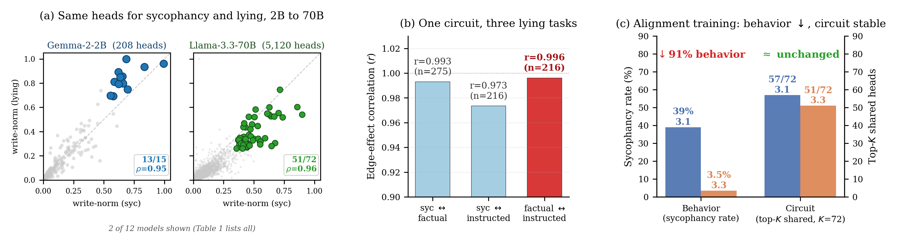

# Shared Sycophancy-Lying Circuit

A mechanistic-interpretability codebase showing that when a language model agrees with a user's wrong answer, the model already knows the answer is wrong. The same attention heads that fire on "this statement is false" fire when the user says "I think the answer is X. Am I right?" — *and the user is wrong*.

[](https://www.python.org/)
[](https://github.com/astral-sh/uv)
[](https://github.com/astral-sh/ruff)
[](https://github.com/astral-sh/ty)
[](#code-quality)
[](#code-quality)

<p align="center">
  
</p>

> **The headline.** Zeroing the shared heads in Gemma-2-2B flips sycophantic agreement **28% → 81%** while factual accuracy moves only **69% → 70%**. The circuit controls deference, not knowledge.

---

## Why this repo

When a chatbot agrees with you that the capital of Australia is Sydney, two stories could explain what's going on inside.

**Story 1 — *blind agreement*.** The model has been trained to please you and doesn't really know any better. Sycophancy is then a knowledge gap, and "more training data / better RLHF" is the fix.

**Story 2 — *registered-but-overridden*.** The model recognises the error through the same circuitry it uses for any false statement. Downstream components produce agreement anyway. Sycophancy is then a routing failure, and the "this is wrong" signal is sitting right there in the activations.

The two stories are *empirically distinguishable* — they predict different mechanistic fingerprints. This codebase is the apparatus that runs the test, on twelve open-weight models from five labs (Gemma-2, Qwen2.5, Qwen3, Llama-3.1/3.3, Mistral, Mixtral, Phi-4) at 1.5B–72B parameters. **Story 2 wins, on every model we tested.**

## Why this direction

Two prior literatures had the right ingredients but never got cooked together.

A **sycophancy-head** line of work (Chen et al., Genadi et al., Li et al.) localizes agreement to a small number of attention heads. A separate **truth-direction** line (Marks & Tegmark, Zou et al., Campbell et al.) shows that "true" vs "false" is linearly readable from residual-stream activations and concentrates in a handful of heads. Where the two were compared directly (Ying et al., Genadi et al.), the head-level overlap looked *limited* — and that limited overlap was read as evidence that sycophancy and lying use **different mechanisms**.

But "same heads writing different directions" and "different heads writing similar directions" are different claims, and the existing comparisons didn't separate them. That's the gap this work closes: we measure component-level sharing directly, on disjoint factual content for each task, with prompt format held constant. The same heads turn out to do both jobs.

## Why these experiments

The full chain of evidence in five hops, each with the analysis that delivers it:

1. **Are the same heads top-ranked for sycophancy and lying?** [`circuit-overlap`](docs/analyses/circuit-overlap.md) computes per-head importance for both tasks on disjoint TriviaQA halves and tests whether the top-K sets overlap above chance. Twelve models, one answer: yes, by a lot. [`layer-strat-null`](docs/analyses/layer-strat-null.md) hardens the null. [`nq-replication`](docs/analyses/nq-replication.md) checks it transfers to NaturalQuestions.

2. **Does it survive a stronger lying paradigm?** [`dla-instructed-lying`](docs/analyses/dla-instructed-lying.md) re-ranks heads under instructed-lying prompts (you tell the model to lie) and re-checks the overlap. Same heads. [`path-patching`](docs/analyses/path-patching.md) traces the *edges* in the circuit, not just nodes — same edges across all three lying paradigms.

3. **Is the overlap causal, or just a ranking coincidence?** Three independent interventions converge: head-zeroing ([`head-zeroing`](docs/analyses/head-zeroing.md)), projection ablation ([`projection-ablation`](docs/analyses/projection-ablation.md)), and activation patching ([`attribution-patching`](docs/analyses/attribution-patching.md), [`activation-patching`](docs/analyses/activation-patching.md)). [`norm-matched`](docs/analyses/norm-matched.md) and [`faithfulness`](docs/analyses/faithfulness.md) rule out confounds.

4. **What about opinions, where there's no ground truth?** [`triple-intersection`](docs/analyses/triple-intersection.md) shows opinion ∩ syc ∩ lie head positions overlap at 51–1,755× chance. But [`opinion-causal`](docs/analyses/opinion-causal.md) and [`direction-analysis`](docs/analyses/direction-analysis.md) show the *direction* opinions write into is orthogonal to the truth direction. Same parking lot, different cars — not a relabeled "truth detector".

5. **Does alignment training touch the substrate?** [`dpo-antisyc`](docs/analyses/dpo-antisyc.md) trains an anti-sycophancy LoRA via DPO on Mistral-7B and Gemma-2-2B (with a sham control). Sycophancy drops 93% and 46% respectively while [`probe-transfer`](docs/analyses/probe-transfer.md) AUROCs stay within ±0.05 — behaviour changes, substrate doesn't. The Llama-3.1→3.3-70B RLHF refresh is the natural-experiment counterpart: behaviour drops 10×, the circuit persists.

The remaining analyses sweep K, swap datasets, control for write-norm magnitude, project through SAEs, and trace MLP mediation — see the per-analysis docs for what each one is for.

---

## Quick start

```bash
git clone git@github.com:MVPandey/shared-sycophancy-lying-circuit.git
cd shared-sycophancy-lying-circuit
uv sync --group dev                                    # ~2 min on a warm cache

uv run pytest                                          # 772 tests, ~7s on CPU
uv run shared-circuits run --help                      # see all 29 analyses

# real run: head overlap on a 2B model (HF auth + ~16 GB GPU)
uv run shared-circuits run circuit-overlap --models gemma-2-2b-it --n-prompts 50
```

Need Python 3.13.9 (3.13.8 has a `torch._jit_internal._overload_method` AST regression that breaks `import torch`). `uv` handles the install.

---

## Map of the repo

```
src/shared_circuits/    library: prompts, data loaders, extraction primitives,
                                 attribution, stats, model loader, analyses
docs/analyses/          one short writeup per analysis (concept + design + how to run)
tests/                  772 tests mirroring src/ structure
Makefile                make check / make <recipe> for paper-reproduction targets
pyproject.toml          deps + tool config (ruff / ty / pytest / coverage)
```

Every analysis follows the same shape: a Pydantic config + `run(cfg)` + an argparse CLI. Programmatic use is identical to the CLI:

```python
from shared_circuits.analyses.circuit_overlap import CircuitOverlapConfig, run
cfg = CircuitOverlapConfig(models=('gemma-2-2b-it', 'Qwen/Qwen3-8B'), n_prompts=50)
run(cfg)   # also persists JSON to experiments/results/
```

`shared_circuits.experiment.model_session(name)` is the canonical way to load a model — context manager that yields a frozen `ExperimentContext` (model + metadata + agree/disagree token IDs) and frees GPU memory on exit, even on exception.

---

## Find the analysis you want

Every analysis has a writeup at `docs/analyses/<slug>.md` covering the mech-interp concept, the design choices, how to run it, and where it shows up in the paper.

**Head-level evidence (§3.1)**
- [`circuit-overlap`](docs/analyses/circuit-overlap.md) — same heads top-rank for syc and lie?
- [`layer-strat-null`](docs/analyses/layer-strat-null.md) — stricter null permuting within layers
- [`nq-replication`](docs/analyses/nq-replication.md) — does the result transfer to NaturalQuestions?
- [`breadth`](docs/analyses/breadth.md) — head overlap + behavioral steering, single-model panel runner

**Three-task structural reuse (§3.2)**
- [`dla-instructed-lying`](docs/analyses/dla-instructed-lying.md) — head ranking under jailbreak / scaffolded / RepE paradigms

**Edge-traced shared circuit (§3.3)**
- [`path-patching`](docs/analyses/path-patching.md) — edge-level causal effects across syc / fact / instructed lying

**Causal validation (§3.4)**
- [`head-zeroing`](docs/analyses/head-zeroing.md) — zero out the shared heads, watch behaviour change
- [`projection-ablation`](docs/analyses/projection-ablation.md) — remove the syc direction from the residual
- [`attribution-patching`](docs/analyses/attribution-patching.md) — per-head clean→corrupt patching (Wang et al.)
- [`activation-patching`](docs/analyses/activation-patching.md) — top-K shared-set patching at scale (≥32B)
- [`causal-ablation`](docs/analyses/causal-ablation.md) — probe-AUROC drop and direction cosine reporting
- [`norm-matched`](docs/analyses/norm-matched.md) — control: random heads matched on `W_O` norm
- [`faithfulness`](docs/analyses/faithfulness.md) — IOI/ACDC sufficiency curve
- [`mlp-ablation`](docs/analyses/mlp-ablation.md) — MLP ablation / disruption-control / tug-of-war (3-in-1)
- [`mlp-mediation`](docs/analyses/mlp-mediation.md) — 16-MLP cross-layer mediation test

**Alignment touches behaviour, not substrate (§3.5)**
- [`dpo-antisyc`](docs/analyses/dpo-antisyc.md) — anti-syc LoRA + DPO with sham control
- [`probe-transfer`](docs/analyses/probe-transfer.md) — does a syc probe transfer to lying?
- [`reverse-projection`](docs/analyses/reverse-projection.md) — cross-task coupling: ablate `d_lie` on syc

**Opinion: positions reused, direction orthogonal (§3.6)**
- [`triple-intersection`](docs/analyses/triple-intersection.md) — opinion ∩ syc ∩ lie heads
- [`opinion-causal`](docs/analyses/opinion-causal.md) — opinion head zeroing + direction-cosine boundary
- [`opinion-circuit-transfer`](docs/analyses/opinion-circuit-transfer.md) — opinion head ranking + permutation overlap

**SAE feature overlap (Table 5)**
- [`sae-feature-overlap`](docs/analyses/sae-feature-overlap.md) — Gemma-Scope + Goodfire feature overlap
- [`sae-k-sensitivity`](docs/analyses/sae-k-sensitivity.md) — feature-overlap K sweep
- [`sae-sentiment-control`](docs/analyses/sae-sentiment-control.md) — syc ∩ sentiment overlap baseline
- [`linear-probe-sae-alignment`](docs/analyses/linear-probe-sae-alignment.md) — LR probe weights vs SAE features

**Cross-cutting**
- [`direction-analysis`](docs/analyses/direction-analysis.md) — per-head + per-layer cosine of `d_syc` vs `d_lie`
- [`logit-lens`](docs/analyses/logit-lens.md) — per-layer DIFF trajectory (Halawi-style detect-then-override)
- [`steering`](docs/analyses/steering.md) — dose-response of `d_syc` at chosen layer
- [`bootstrap-cis`](docs/analyses/bootstrap-cis.md) — post-hoc CI helper over saved JSONs (no GPU)

---

## Reproducing specific paper claims

Per-model orchestration recipes that wrap several analyses behind one `make` target:

```bash
make mixtral-all                   # circuit-overlap + path-patching + norm-matched + breadth on Mixtral-8x7B
make qwen32b-full                  # full causal suite on Qwen2.5-32B
make qwen72b-pipeline              # MLP mediation + breadth on Qwen2.5-72B
make rlhf-natural-experiment       # Llama-3.1 + 3.3 paired (the §3.5 substrate-persists claim)
make zephyr-natural-experiment     # Mistral-7B + Zephyr-7B paired (independent-family replication)
```

Variables (`MIXTRAL=`, `QWEN72B=`, etc.) at the top of the Makefile let you swap model identifiers if you want to re-target a recipe.

---

## Hardware & secrets

- Models up to 32B fit on a single 80–96 GB GPU. 70B and 72B want ≥192 GB across two GPUs (`--n-devices 2`).
- Pipeline parallelism is opt-in via `--n-devices` on `breadth`, `path-patching`, `mlp-mediation`, `projection-ablation` (any analysis that takes the flag).
- Gated models (Gemma, Llama) need `hf auth login`. The library reads `WEIGHT_MIRRORS_JSON='{"original-repo":"mirror-repo"}'` if you have a public mirror.

---

## Code quality

```bash
make check          # ruff check + format + ty + pytest in one shot
```

- Python 3.13.9 (pinned via `.python-version`)
- Ruff for lint + format (PLC0415 enforces top-of-file imports; deferred imports must be marked `# noqa: PLC0415` with a `# deferred:` reason)
- ty (Astral) for type checking; `unresolved-reference = "ignore"` lets us reference `'HookedTransformer'` as a quoted forward ref without importing the heavy library at module load
- pytest with a 95% coverage gate; eight GPU-only analyses are excluded from the gate (their public CLI/config surface is tested, the per-edge guts need a real model)

The paper has the full statistical detail (95% bootstrap CIs, Benjamini-Hochberg correction, layer-stratified permutation nulls, the §A scope statement listing every coverage tradeoff). This repo is the apparatus.
