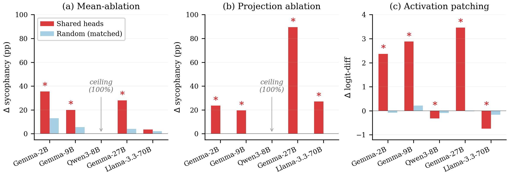

# `causal-ablation`

> Zero out the shared heads. Does the linear probe for sycophancy *and* the linear probe for lying both lose AUROC?

The other ablation analyses in the suite read out behavior (sycophantic agreement rate, agree-vs-disagree logit gap). This one reads out **representations**: train a logistic-regression probe on the residual stream and ask whether knocking out the shared heads weakens the probe's ability to separate the two classes. If the heads carry information *both* tasks rely on, both probes degrade together.

<p align="center">
  
</p>

## The mech-interp idea

A **linear probe** is a logistic-regression classifier trained on residual-stream activations to discriminate two prompt classes — here, "user-is-wrong" vs "user-is-right" for sycophancy, and "tell-me-a-lie" vs "tell-me-the-truth" for factual lying. AUROC is the probe's separation quality. If both probes pick up *the same* underlying signal, then ablating whichever heads write that signal should drop both AUROCs.

We extract residuals at layer `0.85 × n_layers` (default; mid-to-late, where the relevant features are typically strongest), run four conditions, and report syc-probe AUROC, lie-probe AUROC, and the cosine between the two task directions (`d_syc = mean(wrong) − mean(right)`, `d_lie = mean(false) − mean(true)`):

- `no_ablation` — baseline.
- `ablate_top5_shared` — zero the top 5 shared heads (by combined importance from [`circuit-overlap`](circuit-overlap.md)).
- `ablate_top10_shared` — same, top 10.
- `ablate_5_random` — count-matched random non-shared heads, fixed seed.

The verdict triages on the *top-5* condition: a `CAUSAL_SHARED` label means both AUROCs dropped by at least 0.05; `PARTIAL_CAUSAL` if one did; `NOT_CAUSAL` otherwise. The cosine readout is informational — if the two probe directions stay highly aligned post-ablation, that's another shared-substrate fingerprint complementing the AUROC drop.

## Why this design

- **Layer `0.85 × n_layers` is intentional.** Probe quality typically peaks late-mid in instruction-tuned models, where the residual has integrated everything but not yet been collapsed onto the unembedding. 0.85 is the legacy default; override with `--probe-layer-frac` if your model's signal lives earlier.
- **Top-5 *and* top-10.** Top-5 stress-tests the small-set sufficiency claim (does zeroing a handful of heads matter?); top-10 catches partial-redundancy cases where 5 isn't quite enough.
- **Random control draws from the full non-shared pool.** Not norm-matched here — the [`norm-matched`](norm-matched.md) analysis handles that confound separately. This control is the count-matched lower bar.
- **Verdict reads the AUROC delta on top-5.** A 0.05 AUROC drop is a non-trivial hit on a probe that's typically in the 0.85–0.95 range; the threshold matches the equivalence margin used elsewhere in §3.5.

## How to run it

```bash
# Default 3-model panel (Gemma-2-2B-IT, Qwen2.5-1.5B, Qwen3-8B)
uv run shared-circuits run causal-ablation

# Single model, more probe data
uv run shared-circuits run causal-ablation \
  --models gemma-2-2b-it --n-probe-prompts 200

# Move the probe layer earlier (default is 0.85)
uv run shared-circuits run causal-ablation \
  --models Qwen/Qwen3-8B --probe-layer-frac 0.7

# Use a different K bucket for the shared-head list
uv run shared-circuits run causal-ablation \
  --models gemma-2-2b-it --shared-heads-k 30
```

Output: `experiments/results/causal_ablation_<model_slug>.json`, one per model. Key fields per condition:

| Field | Meaning |
|---|---|
| `verdict` | `CAUSAL_SHARED` / `PARTIAL_CAUSAL` / `NOT_CAUSAL` (top-5 condition) |
| `probe_layer` | Resolved residual layer used for both probes |
| `<condition>.syc_probe_auroc` | LR probe AUROC on user-wrong vs user-right |
| `<condition>.lie_probe_auroc` | LR probe AUROC on instruct-lie vs instruct-truth |
| `<condition>.cosine` | Cosine between `d_syc` and `d_lie` mean-difference directions |
| `<condition>.ablated_heads` | Heads zeroed in this condition (or `null` for baseline) |

## Where it lives in the paper

§3.4, the causal-validation suite. The probe-AUROC drop is the representational counterpart to the behavioral readouts in [`head-zeroing`](head-zeroing.md), [`projection-ablation`](projection-ablation.md), and [`activation-patching`](activation-patching.md). All four are cells in the §3.4 grid (Figure `causal`); the BH-corrected `q < 0.05` threshold for the full 18-cell grid is in Appendix `bh`. Concordant verdicts across all four interventions on the shared set is what powers the "three methods converge through 70B" claim.

## Source

`src/shared_circuits/analyses/causal_ablation.py` (~150 lines). Reads `shared_heads` from a saved [`circuit-overlap`](circuit-overlap.md) JSON. Internal helpers: `extract_residual_with_ablation` (residual extraction with attention-head zero hooks), `train_probe` (sklearn `LogisticRegression`), `cosine_similarity`. Sibling causal-suite analyses: [`head-zeroing`](head-zeroing.md), [`projection-ablation`](projection-ablation.md), [`activation-patching`](activation-patching.md), [`attribution-patching`](attribution-patching.md), [`norm-matched`](norm-matched.md), [`faithfulness`](faithfulness.md).
