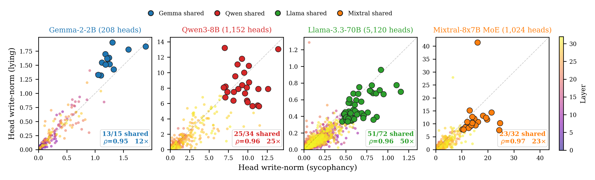

# `circuit-overlap`

> Are the same attention heads top-ranked for sycophancy and for factual lying?

This is the entry point to the whole story. If two tasks are computed by the same heads, that's a strong hint they share machinery. We measure that hint directly across twelve open-weight models.

<p align="center">
  
</p>

## The mech-interp idea

For each task `t` (sycophancy or factual lying), each attention head `(layer, head)` writes some vector into the residual stream. We can score how much the head *cares about the task* by asking: how different is the head's average write-vector on positive vs negative examples? A head that fires identically on "user wrong" and "user right" prompts gets a low score; a head that writes something distinctive in the wrong-user case gets a high score.

The score is the L2 norm of the difference of mean per-head outputs:
```
w_{l,h}^{(t)} = || W_O^{(l,h)} ( v̄_{l,h}^+ − v̄_{l,h}^− ) ||₂
```
where `v̄^±` is the head's mean *value* output on positive (e.g. user-is-wrong) vs negative (user-is-right) prompts. This is the **write-norm form of Direct Logit Attribution** — the cheap proxy for the more expensive activation-patching intervention. We validate the proxy against actual patching at ≤8B in [`attribution-patching`](attribution-patching.md).

Once every head has a score for sycophancy and a score for lying, we ask: do the top-K sets overlap more than chance? With `K = ⌈√N⌉` (chance overlap ≈ 1 head), we can convert the raw count into a hypergeometric p-value plus a permutation null. Both nulls are reported.

## Why this design

- **Disjoint content for the two tasks.** Sycophancy uses TriviaQA pairs `[0, 200)`; lying uses pairs `[200, 400)`. Same template family, completely different facts. This rules out "same heads because same trivia surface forms" as an explanation for the overlap.
- **Write-norm rather than gradient-based attribution.** Per-head DLA is `O(1)` forward passes per task; full per-head activation patching costs `O(n_layers × n_heads)` forward passes. We use DLA as the primary measurement and validate it with patching where compute permits.
- **Both nulls.** Hypergeometric is fast and well-understood but ignores layer-wise clustering of important heads. The permutation null preserves the per-layer marginal — see [`layer-strat-null`](layer-strat-null.md) for the stricter version.
- **Scale-invariant fraction, not just ratio.** The raw `K²/N` chance baseline mechanically scales with `√N`, making the ratio unflattering at scale. The shared *fraction* (`overlap / K`) is what we report alongside.

## How to run it

```bash
# Single model
uv run shared-circuits run circuit-overlap --models gemma-2-2b-it

# Full 12-model panel (requires GPU and ~hours of compute)
uv run shared-circuits run circuit-overlap

# Override prompt count (default 50 per condition)
uv run shared-circuits run circuit-overlap --models Qwen/Qwen3-8B --n-prompts 100
```

Output: `experiments/results/circuit_overlap_<model_slug>.json` per model. Key fields:

| Field | Meaning |
|---|---|
| `verdict` | `SHARED_CIRCUIT` / `PARTIAL_OVERLAP` / `SEPARATE_CIRCUITS` |
| `overlap_by_K` | List of `{K, overlap, expected, ratio, p_hypergeometric, p_permutation, shared_heads}` |
| `rank_correlation` | Spearman ρ + p over the full head population |
| `syc_top15` / `lie_top15` | Per-task top-15 heads with their scores |

## Where it lives in the paper

§3.1, **Table 1** — the 12-model panel. Result: shared fraction 40–87% (median 67%), Spearman ρ 0.80–0.97, all hypergeometric p < 10⁻³. The 13 rows include Llama-3.3-70B (Meta's RLHF refresh of Llama-3.1-70B) as the substrate-persistence anchor for §3.5.

## Source

`src/shared_circuits/analyses/circuit_overlap.py` (~120 lines). Reads no prior results; produces `circuit_overlap_<model>.json` consumed downstream by [`causal-ablation`](causal-ablation.md), [`triple-intersection`](triple-intersection.md), [`head-zeroing`](head-zeroing.md), [`norm-matched`](norm-matched.md), [`activation-patching`](activation-patching.md), [`mlp-mediation`](mlp-mediation.md), [`faithfulness`](faithfulness.md).
