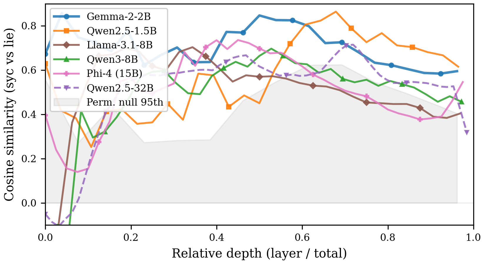

# `direction-analysis`

> Per-layer cosine between `d_syc` and `d_lie`. Are the syc and lie directions the same direction, or just close cousins?

If sycophancy and lying use the *same* internal feature, the per-layer mean-difference directions should sit at cosine `1.0`. They don't — they sit between `0.43` and `0.81` on the top-K shared heads, with a per-layer profile that peaks at 50–80% depth. The directions are aligned but not identical: a partial reduction to the truth direction, not a corollary of it.

<p align="center">
  
</p>

## The mech-interp idea

A **mean-difference direction** in residual-stream space is the unit vector pointing from one task condition to the other. For sycophancy: `d_syc = mean(wrong-opinion-resid) − mean(right-opinion-resid)`. For factual lying: `d_lie = mean(false-statement-resid) − mean(true-statement-resid)`. The construction is exactly Marks & Tegmark's truth direction (2024) and the mean-difference vector at the heart of Zou et al.'s representation engineering (2023).

If the two tasks share a substrate, the cosine `d_syc · d_lie` should be high. If they use independent features, the cosine should be near zero. The headline number runs at the late-layer mean across a `target_layers` sample (every 2nd layer + always the final layer); the **late layers** are the second two-thirds of the depth, where Halawi et al. (2024) and McGrath et al. (2023) place the answer-resolution machinery.

A **permutation null** breaks the syc labels: `n_permutations × |late_layers|` shuffles independently re-mix the wrong-vs-right labels at each late layer and re-cosine against the (unshuffled) lie direction. The 95th-percentile null cosine is the threshold; the **margin** is `late_layer_mean_cosine − null_95th_percentile`.

The two scopes — *per-head* on the top-20 shared heads (the mean-cos `0.43–0.81` numbers in `tab:directional`) and *per-layer* on the residual stream — answer different things. Per-head says the heads write similar things on the two tasks; per-layer says the bulk residual is similar in those layers. The reconciliation appendix (`app:reconciliation`) uses both: the partial reduction to the truth direction is the per-head story, the layer-wise alignment is the per-layer story, and the §3.5 / §4 `tab:probe-ci` AUROC is a separate (tighter) bound.

## Why this design

- **Layers sampled every 2 + the final.** Full-depth coverage at `every 2nd layer + final` keeps the cost bounded on 80-layer models without leaving the headline late layer out of the cosine computation.
- **Late layers `≥ 2/3 × n_layers`.** The `app:cosine` appendix profile in `direction_cosine_by_layer.png` shows the alignment peaks at 50–80% depth — the `2/3` cutoff captures the peak and the attenuation that follows. (`_LATE_LAYER_FRAC = 2/3` in source.)
- **Permutation null pools the late-layer cosines.** `n_permutations × |late_layers|` total samples — for an 80-layer model that's `n_perm × 27`, which gives a stable 95th-percentile estimate on the relatively narrow late-layer cosine distribution.
- **Default `n_pairs = 400`, `n_prompts = 50`.** Matches the rest of the paper's TriviaQA split (pairs `[0, 200)` for syc, `[200, 400)` for lie). 50 prompts per condition for direction estimation is roomy compared to the 30–40 the layerwise direction estimates stabilize at on 7B models in pilots.
- **No `--single-model`.** Always multi-model. The whole point is the cross-model comparison in figure J.1 (six models, four families).

## How to run it

```bash
# Default sweep (ALL_MODELS panel)
uv run shared-circuits run direction-analysis

# Single-model spot-check
uv run shared-circuits run direction-analysis --models gemma-2-2b-it

# Tighter null (10x more permutations)
uv run shared-circuits run direction-analysis --n-permutations 5000

# More prompts per condition (e.g. for 70B noise reduction)
uv run shared-circuits run direction-analysis \
  --models meta-llama/Llama-3.1-70B-Instruct --n-prompts 100
```

Output: `experiments/results/direction_analysis_<model>.json`. Key fields:

| Field | Meaning |
|---|---|
| `target_layers` / `late_layers` | Which layers were sampled and which fall in the late pool |
| `layer_cosines.<L>.cosine` / `pct_depth` | Per-layer cosine and normalized depth (the figure J.1 trace) |
| `late_layer_mean_cosine` | Mean cosine across the late-layer pool — the `tab:cosine` column |
| `null_95th_percentile` | 95th percentile of the permutation null over late layers |
| `margin` | `late_layer_mean_cosine − null_95th_percentile` — positive = above null |

## Where it lives in the paper

Appendix `app:cosine`, `tab:cosine` and `fig:cosine`. Headline residual-stream late-layer cosines (with permutation 95th in parens, margin): Qwen2.5-1.5B `0.728` (null `0.49`, margin `0.24`), Qwen3-8B `0.519` (`0.30`, `0.22`), Gemma-2-2B-IT `0.664` (`0.50`, `0.16`), Qwen2.5-32B `0.593` (`0.44`, `0.15`), Phi-4 `0.469` (`0.38`, `0.09`), Llama-3.1-8B `0.437` (`0.38`, `0.06`). The per-head version (the more striking `0.43–0.81` mean cosine across top-20 shared heads) lives in `tab:directional` (Appendix `app:directional`) and is computed by [`circuit-overlap`](circuit-overlap.md)'s downstream consumers, not here. The reconciliation appendix (`app:reconciliation`) with Marks & Tegmark / Zou et al. cites *both* — the head-level cosines + the residual-stream cosines + the [`probe-transfer`](probe-transfer.md) AUROC of `0.83` together establish "aligned but not identical".

## Source

`src/shared_circuits/analyses/direction_analysis.py` (~115 lines). Sibling of [`circuit-overlap`](circuit-overlap.md) (the head-level write-norm version of the same alignment question), [`reverse-projection`](reverse-projection.md) (which uses the same per-layer directions as ablation targets), and [`opinion-causal`](opinion-causal.md) `boundary` mode (the same per-layer cosine machinery applied to opinion-vs-fact rather than syc-vs-lie).
