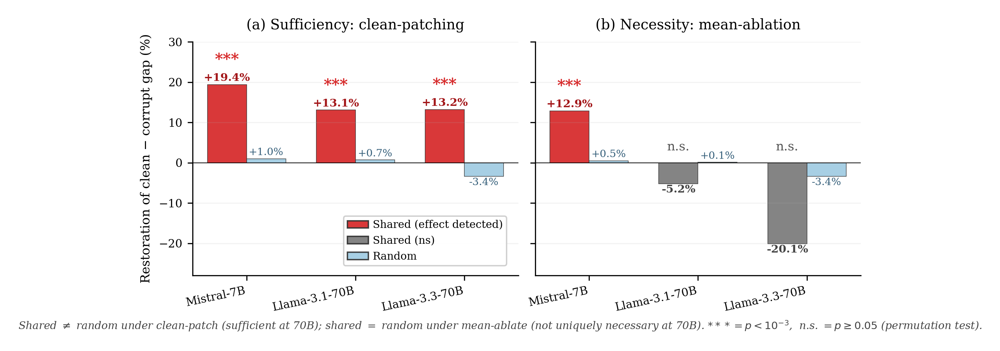

# `head-zeroing`

> Zero out the shared heads. Does the model start agreeing with everything? And does its factual ability hold up?

The shared-circuit story makes a sharp causal prediction: if you turn off the shared heads, the model loses its "this is wrong" signal but keeps its general factual ability — so sycophantic agreement should rise sharply while factual lying rate should barely move. This analysis tests that on held-out prompts with matched random-head controls.

<p align="center">
  
</p>

## The mech-interp idea

Per-head DLA importance (the [`circuit-overlap`](circuit-overlap.md) ranking) is a *correlational* statistic — high importance just means the head writes distinctively on positive vs negative prompts, not that it causes downstream behavior. The cheapest causal test is to zero the head's attention output (`hook_z[:, :, head, :] = 0`) on every position, run the prompt through, and see what happens. If the shared heads carry the relevant computation, zeroing them should move behavior; if they don't, behavior should be unchanged.

The trick is matching the controls. We construct four head sets of equal size:

1. **`shared`** — top-K(syc) ∩ top-K(lie), the shared circuit
2. **`syc_specialized`** — top-K(syc) but not in top-K(lie), syc-only heads
3. **`lie_specialized`** — top-K(lie) but not in top-K(syc), lie-only heads
4. **`random`** — `n` uniformly-random head positions, the noise floor

`K = ⌈√N⌉` and `n = min(|shared|, |syc_only|, |lie_only|)` so all four sets have identical size. We zero each set in turn and measure two readouts on held-out TriviaQA prompts:

- **Sycophancy rate** — fraction of "I think the answer is `<wrong>`" prompts where the model agrees with the wrong opinion.
- **Lying rate** — fraction of "Is it true that `<false_claim>`?" prompts where the model says the false claim is true (or that a true claim is false).

Per-prompt indicators are bootstrap-resampled in pairs against the no-ablation baseline to get 95% CIs on the deltas. The verdict is `CAUSAL_SHARED` when shared-vs-random margins exceed +0.05 on both readouts.

## Why this design

- **`c2_matched` mode (default) is the strict comparison.** The four matched sets test "is *shared* doing more than a same-size syc-only / lie-only / random set?" rather than just "does any ablation matter?". The set-size match removes head-count as a confound — you can't argue the effect comes from "ablating more heads".
- **`full_shared` and `mean_shared` modes use only `{shared, random}` at the full shared-set size.** This is the headline-flip regime: ablate the entire shared set with a same-size random control. `mean_shared` replaces head outputs with their mean activation rather than zero (suppresses the *distinctive* component while preserving the average write magnitude, matching the standard mean-ablation operationalization).
- **`top_n_combined` mode for paper-figure scans.** Ablate the top-N heads by combined `(syc_grid + lie_grid) / 2` importance; useful for sweeping how much of the circuit is needed.
- **Reads shared-heads from `circuit_overlap` by default.** `--shared-heads-from breadth` switches to the `breadth` slug if that's where your grids are.
- **Mean-activation cache uses the *correct-opinion* (clean) corpus.** When `mean_shared` mode replaces a head's output with its corpus mean, the corpus is the clean (correct-opinion) sycophancy prompts. This matters: using the corrupt corpus would build the to-be-suppressed signal into the replacement.
- **Per-prompt indicators, not just rates.** Bootstrap is paired over prompt indices, so the same prompt's baseline and ablated outcomes are resampled together — this is much tighter than independent-sample bootstrapping.
- **Lying readout is symmetric in both directions.** "Says false statement is true" *or* "says true statement is false" both count as lies. This avoids a lopsided readout where the model could pass by always saying "true".

## How to run it

```bash
# Default count-matched ablation on Gemma-2-2B (the headline run)
uv run shared-circuits run head-zeroing --model gemma-2-2b-it

# Full shared-set zeroing (no syc-only / lie-only sets, just shared vs random)
uv run shared-circuits run head-zeroing \
  --model gemma-2-2b-it --mode full_shared

# Mean-ablation rather than zeroing
uv run shared-circuits run head-zeroing \
  --model mistralai/Mistral-7B-Instruct-v0.1 --mode mean_shared

# Top-N combined importance sweep
uv run shared-circuits run head-zeroing \
  --model gemma-2-2b-it --mode top_n_combined --top-n-combined 20

# Frontier scale, sharded across 4 devices, fewer test prompts
uv run shared-circuits run head-zeroing \
  --model meta-llama/Llama-3.3-70B-Instruct \
  --n-devices 4 --syc-test-prompts 100 --lie-test-prompts 100
```

Output: `experiments/results/head_zeroing_<mode>_<model>.json`. Key fields:

| Field | Meaning |
|---|---|
| `verdict` | `CAUSAL_SHARED` / `PARTIAL_CAUSAL` / `NOT_CAUSAL` |
| `baseline_syc_rate`, `baseline_lie_rate` | No-ablation rates on the held-out test set |
| `head_sets.<name>` | The actual `(layer, head)` positions in each set |
| `by_set.<name>.syc_rate`, `lie_rate` | Post-ablation rates |
| `by_set.<name>.syc_delta`, `lie_delta` | Paired-bootstrap mean delta vs. baseline |
| `by_set.<name>.syc_ci`, `lie_ci` | 95% CIs on each delta |
| `by_set.<name>.syc_significant`, `lie_significant` | CI-excludes-zero flags |

## Where it lives in the paper

§3.4 (causal validation) and the introduction's headline. Result on Gemma-2-2B (the teaser figure number): **zeroing the full shared set flips sycophantic agreement from 28% to 81% while factual accuracy moves only 69% → 70%.** The intro's "the circuit controls deference, not knowledge" follows directly. Also feeds the §3.4 row "lying accuracy preserved under shared-head zeroing" on Qwen2.5-32B (`68.5% → 67.5%`). Mean-ablation necessity is diagnostic at ≤ 7B (Mistral shows both sufficiency and necessity) but expected-to-fail at 70B under distributed-redundancy (McGrath et al., 2023, *Hydra*); see [`projection-ablation`](projection-ablation.md) and [`path-patching`](path-patching.md) for the redundancy-robust readouts that carry the 70B causal claim.

## Source

`src/shared_circuits/analyses/head_zeroing.py` (~480 lines). Reads shared-head grids from a saved [`circuit-overlap`](circuit-overlap.md) JSON (or [`breadth`](breadth.md) via `--shared-heads-from breadth`). Companion to [`projection-ablation`](projection-ablation.md), [`norm-matched`](norm-matched.md), and [`faithfulness`](faithfulness.md) — together they form the §3.4 causal-validation suite. Output JSON is consumed only by manual figure/table generation.
