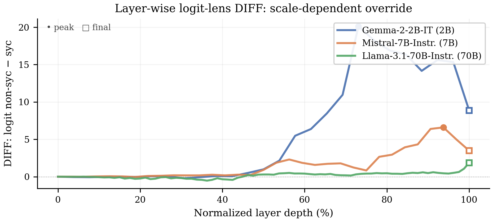

# `logit-lens`

> When the model agrees with a wrong-opinion user, did some earlier layer already get the right answer?

This is the Halawi-style "overthinking the truth" trajectory adapted to sycophancy. We project the residual stream at every layer through the unembedding matrix and watch the per-layer answer-token log-odds across sycophantic vs non-sycophantic trials. A mid-layer peak followed by late-layer attenuation is the **detect-then-override** signature: the model registers the correct answer internally, then commits to agreement at output time.

<p align="center">
  
</p>

## The mech-interp idea

The **logit lens** (nostalgebraist 2020; Halawi et al. 2024) projects intermediate residual-stream activations through the model's final layer-norm and unembedding matrix `W_U`, treating each layer as if it were the output. The result is per-layer log-odds for any pair of vocabulary tokens — here the agree vs disagree token sets that the rest of the paper uses. Halawi et al. (2024) showed that on TruthfulQA-style questions, the mid-layer logits encode the *correct* answer while the final-layer commits to the *imitative* (wrong) answer. We replicate that protocol on sycophancy prompts.

For each wrong-opinion prompt we extract the residual stream at every layer, run it through `ln_final` + `W_U`, and record `disagree_max − agree_max` (positive = disagree-ish, negative = agree-ish). Then we split prompts into **sycophantic trials** (model agrees with the wrong opinion at the last token) and **non-sycophantic trials** (model correctly disagrees), and report `DIFF = mean(non-syc) − mean(syc)` at every layer.

A **mid-layer peak in DIFF** followed by **late-layer attenuation** says the internal state on the syc-trial prompts resolved toward "disagree" before something downstream re-routed to "agree". The **peak excess** = `100 × (peak_DIFF − final_DIFF) / final_DIFF` summarizes how much overshoot is in the trajectory; `0%` means monotonic, no override. A **label-shuffle permutation null** (`n_perm = 1,000` shuffles of the syc/non-syc labels) bounds per-layer significance.

The result connects to McGrath et al.'s "hydra effect" (2023) on distributed redundancy: a discrete mid-layer override at 2B–7B (peak excess `+127%` on Gemma-2-2B, `+89%` on Mistral-7B) dissolves into distributed execution at 70B (peak `0%` on Llama-3.1-70B), the same scaling story §3.4 + §3.5 tells via mean-ablation nulls and projection ablation gains.

## Why this design

- **Project at every layer, not just a sample.** Mid-layer override events are narrow (1–3 layers wide); subsampling would risk missing the peak. Cost is one extra `W_U` projection per layer per prompt — cheap.
- **`ln_final` before `W_U`.** Skipping the final layer-norm distorts the projection; the layers further from `ln_final` would underestimate their logit-lens DIFF. Pipeline-parallel models route the projection to the device that holds `W_U` (the last device).
- **Label split is *behavioral*, not pre-specified.** We don't pick which prompts are sycophantic ahead of time — `measure_agreement_per_prompt` decides at the last token, model by model. The split therefore tracks the trajectory of *prompts the model actually got wrong*, which is the right reference class for Halawi's "compute correct, override late" hypothesis.
- **Per-layer p-values and bootstrap CIs at the same time.** `_per_layer_stats` bootstraps the per-layer DIFF mean (`n_boot = 1,000` resamples), and `_permutation_null` runs the label shuffle. Two complementary uncertainty estimates on different sources of variability: prompt sampling and label assignment.
- **Single-model only.** Each run is one trace + one peak-excess number. Multi-model would convolve trajectories from different layer counts; you want them plotted on the same normalized-depth axis side by side, which is what `logit_lens_trajectory.png` does.

## How to run it

```bash
# Headline: Gemma-2-2B-IT (the +127% peak excess)
uv run shared-circuits run logit-lens --model gemma-2-2b-it

# Mistral-7B (the +89% peak excess)
uv run shared-circuits run logit-lens --model mistralai/Mistral-7B-Instruct-v0.1

# 70B run (the monotonic 0%-excess case; needs --n-devices 2)
uv run shared-circuits run logit-lens \
  --model meta-llama/Llama-3.1-70B-Instruct --n-devices 2

# Tighter null + bootstrap
uv run shared-circuits run logit-lens \
  --model gemma-2-2b-it --n-perm 5000 --n-boot 5000
```

Output: `experiments/results/logit_lens_<model>.json`. Key fields:

| Field | Meaning |
|---|---|
| `n_sycophantic` / `n_non_sycophantic` | Behavioral split sizes (how many of `n_pairs` the model got wrong) |
| `sycophantic_trajectory.mean` / `ci_lo` / `ci_hi` | Per-layer DIFF on syc trials with 95% bootstrap CI |
| `non_sycophantic_trajectory.*` | Same on non-syc trials |
| `diff_per_layer` | `mean(non-syc) − mean(syc)` per layer (the figure-9 line) |
| `peak_layer` / `peak_excess` | `argmax(\|DIFF\|)` and the `{peak, final, excess, excess_ratio}` payload |
| `perm_null_pvalue` | Per-layer two-sided permutation p-value |
| `significant_layers` | Layer indices with `p < 0.05` (the `15/27`, `25/33`, `25/81` columns of `tab:logitlens`) |

## Where it lives in the paper

Appendix `app:logitlens`, `fig:logitlens` and `tab:logitlens`. Headline numbers, per `tab:logitlens`:

| Model | Peak DIFF | Peak layer | Final DIFF | Peak excess | Perm-null sig. |
|---|---|---|---|---|---|
| Gemma-2-2B-IT | `+20.12` | L19 of 26 | `+8.87` | `+127%` | 15/27 (56%) |
| Mistral-7B-Instruct | `+6.60` | L30 of 32 | `+3.49` | `+89%` | 25/33 (76%) |
| Llama-3.1-70B-Instruct | `+1.86` | L80 (final) | `+1.86` | `0%` (monotonic) | 25/81 (31%) |

The §3.4 framing this corroborates: the 70B mean-ablation null (Appendix `app:null`) and the 70B projection-ablation gain are the same scaling story from a different lens. A discrete mid-layer override at 2B–7B is consistent with concentrated mechanism; the 70B monotonic trajectory is consistent with distributed redundancy à la McGrath et al. (2023).

## Source

`src/shared_circuits/analyses/logit_lens.py` (~220 lines). Reads no upstream JSON — independent of the head-level pipeline. Sibling to [`direction-analysis`](direction-analysis.md) (a different per-layer view of the same trajectory) and [`probe-transfer`](probe-transfer.md) (the per-prompt analogue at a single fixed layer). The §3.4 mean-ablation null at 70B in [`head-zeroing`](head-zeroing.md) is the orthogonal evidence that supports the same scaling claim.
