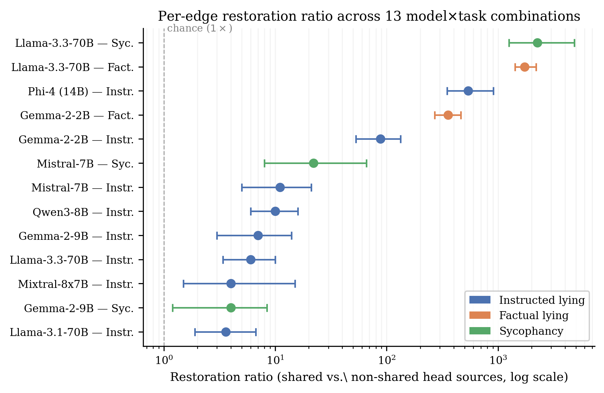

# `path-patching`

> If two heads write similar things, do they actually talk to each other? Edge-level path patching answers at the wire-by-wire granularity.

Head-level overlap is consistent with both genuine shared computation and coincidental ranking agreement. To distinguish, we trace the circuit at edge resolution: for every ordered pair `(source-head → receiver)` where source is one of the shared heads and receiver is another shared head at a deeper layer (or the unembed), we measure the *direct* causal effect of just that single edge. This is the Wang et al. (2023) IOI-style path-patching apparatus, applied at the standard head-to-head and head-to-unembed granularity (no ACDC-style Q/K/V/output subtyping).

<p align="center">
  
</p>

## The mech-interp idea

A circuit isn't just a set of heads — it's a *graph* of heads connected by causal edges through the residual stream. Two heads can be top-ranked on the same task without ever talking to each other; they could be parallel, redundant, or independently downstream of the same earlier component.

Path patching (Wang et al., 2023) tests an edge `s → r` like this. Run a clean (correct-answer) prompt and cache every head's `z` activation. Run the matched corrupt (wrong-answer) prompt and cache *its* `z` activations. Now run the corrupt prompt one more time, but with two surgical changes:

1. Splice the **clean** activation of head `s` at its position into the corrupt run.
2. Freeze every other intermediate head and MLP at its **corrupt** value, so the only path along which `s`'s clean signal can reach `r` is the direct one.

Whatever happens at receiver `r`'s output is the **direct effect of the `s → r` edge**, isolated from indirect paths that go through other heads. We measure that effect by projecting `r`'s output onto a per-layer task direction `(mean corrupt resid − mean clean resid)`, normalized; for the unembed receiver we just take the agree-vs-disagree logit difference.

The headline statistic is the **restoration ratio**: the bootstrap ratio of mean restoration on shared-head sources to mean restoration on non-shared sources. A ratio of 1× means shared heads behave like random heads as edge sources; a ratio of 50× means the shared heads carry the signal, the rest don't. The paper reports per-edge effects correlating at `r > 0.97` across the three lying paradigms on Gemma-2-2B (sycophancy / factual lying / instructed lying) and `r = 0.988–0.995` on Phi-4. The cross-paradigm circuit is real at the edge level, not just at the node level.

## Why this design

- **One model, one task per invocation.** Path patching is the most expensive analysis in the repo — Gemma-2-2B at full edge resolution takes hours per task. The CLI takes a single `--model` and `--task` so paper-replication scripts can dispatch in parallel.
- **`--shared-source` selects which definition of "shared".** The default reads `gate14_head_grid_*.json` or `breadth_*.json`; pass `instructed` / `scaffolded` / `repe` to read the corresponding [`dla-instructed-lying`](dla-instructed-lying.md) grid. This is what makes the cross-paradigm comparison possible — same edge-tracing apparatus, different definition of "shared heads" feeding it.
- **`--no-head-edges` halves the runtime at frontier scale.** At 70B, even with shared-only sources, head-to-head edges are intractable. The flag restricts edges to source→unembed only, which is what the Llama-3.3-70B row of Table 3 reports. Per-paper: at 70B "we report head-to-unembed direct effects only".
- **Non-shared sources as the negative control.** `--non-shared-sources -1` runs every non-shared head as a source for source→unembed edges; `--non-shared-sources N` uniformly samples N. This is what the restoration-ratio denominator is computed against, and it's what makes the `1,732×` shared/non-shared ratio on Llama-3.3-70B factual lying meaningful.
- **Per-layer task direction extracted on the same prompts.** For non-unembed receivers, the head's contribution is projected onto `(mean corrupt resid − mean clean resid) / ||·||` at the receiver's layer. This isolates the task-relevant component of the head's write rather than measuring a generic activation magnitude.
- **`--prefill-shift` for the chat-template tokenizer issue.** Some chat tokenizers greedy-merge whitespace tokens at the prompt boundary, silently shifting the position where the model emits the next token. The flag greedy-generates one token per prompt before measuring, anchoring the measurement at the actual answer position rather than the formal end of the prompt. The paper appendix on templates covers this in more detail.
- **Bootstrap CIs at `n_boot=1000`.** Per-edge `(mean, [2.5%, 97.5%])` from a percentile bootstrap, plus an `is_significant` flag for CIs excluding zero. These are the CIs reported in Table 3.

## How to run it

```bash
# Sycophancy circuit, Gemma-2-2B, full edge graph (multi-hour run)
uv run shared-circuits run path-patching --model gemma-2-2b-it --task sycophancy

# Factual-lying circuit on the same model, with non-shared head sources as the control
uv run shared-circuits run path-patching \
  --model gemma-2-2b-it --task lying \
  --non-shared-sources 50

# Instructed-lying circuit using the dla_instructed_<model> grid for "shared"
uv run shared-circuits run path-patching \
  --model microsoft/phi-4 --task instructed_lying \
  --shared-source instructed

# Llama-3.3-70B head-to-unembed only (cheaper, what Table 3 reports for 70B)
uv run shared-circuits run path-patching \
  --model meta-llama/Llama-3.3-70B-Instruct --task lying \
  --no-head-edges --n-pairs 30

# Use prefill-shift to pin the measurement at the model's argmax answer position
uv run shared-circuits run path-patching \
  --model gemma-2-2b-it --task sycophancy --prefill-shift
```

Output: `experiments/results/path_patching_<task>_<model>.json`. Key fields:

| Field | Meaning |
|---|---|
| `shared_heads_ranked` | The shared-head set used as edge sources, ranked by combined importance |
| `sources` | List of `[(layer, head), 'shared'/'non_shared']` actually run |
| `baseline_clean_logit_diff` / `baseline_corrupt_logit_diff` | Sanity-check baselines for the prompt set |
| `edges` | Map from `'<src_layer>.<src_head>->{<recv_layer>.<recv_head>\|unembed}'` to `{mean, ci_95, significant, n_pairs, source_type}` |

The downstream paper-table builder reads this JSON to compute the restoration ratio (shared mean / non-shared mean over `→unembed` edges) and the per-pair Pearson correlation between tasks.

## Where it lives in the paper

§3.3 ("Edge-traced shared circuit"), **Table 3** (`tab:restoration`). Headline numbers:

- **Gemma-2-2B**: per-edge effects correlate at `r = 0.993` across the 275-edge sycophancy-vs-factual circuit and `r = 0.973–0.996` across the 216 edges shared by all three lying contrasts.
- **Phi-4 (14B)**: replication at `r = 0.988–0.995` across 38–229 edges, with shared-head sources restoring 90–102% of the clean-vs-corrupt gap on all three Phi-4 tasks while non-shared sources restore near-zero.
- **Llama-3.3-70B (head-to-unembed only)**: factual-lying restoration ratio `1,732×`; sycophancy `2,248×`; instructed lying `6×`. Task-contrast variance dominates scale rather than parameter count.
- Every one of the 13 model×task rows in Table 3 has a 95% bootstrap CI excluding 1.0×.

## Source

`src/shared_circuits/analyses/path_patching.py` (~620 lines, the largest analysis in the repo). Reads shared-head grids from a saved [`circuit-overlap`](circuit-overlap.md) / [`breadth`](breadth.md) JSON or one of the [`dla-instructed-lying`](dla-instructed-lying.md) paradigm JSONs (selected by `--shared-source`). Output is consumed by manual paper-table generation; no other analysis ingests it programmatically.
