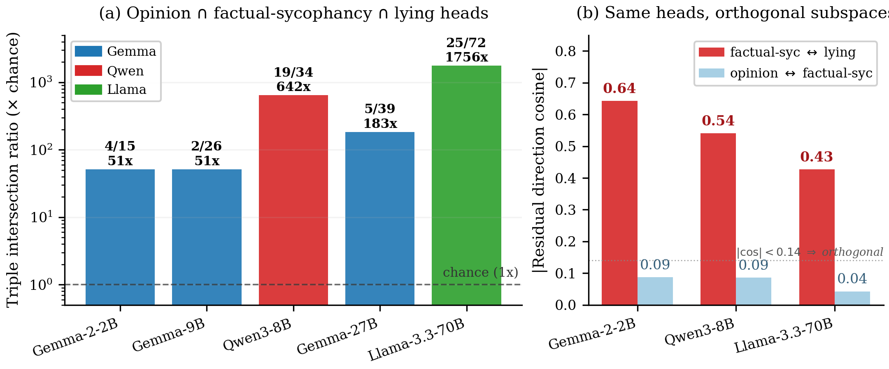

# `sae-feature-overlap`

> Do sycophancy and lying activate the *same dictionary atoms* inside a sparse autoencoder, or just collide in the same residual subspace?

The head-level overlap in [`circuit-overlap`](circuit-overlap.md) tells you the same `(layer, head)` positions are top-ranked for both tasks. That's compatible with two stories: the heads write the same *features* on both tasks, or the heads write different features that happen to share a residual subspace by **superposition** (Elhage et al. 2022 — many features sharing a small residual dimension via near-orthogonal directions). Sparse autoencoders separate those two stories. If the same SAE features fire on syc and lie inputs, it really is shared machinery; if the heads collide in the residual but light up different SAE atoms, the head-overlap result was a superposition coincidence.

<p align="center">
  
</p>

## The mech-interp idea

Sparse autoencoders (Cunningham et al. 2023; Bricken et al. 2023) decompose an activation `a ∈ ℝᵈ` into a sparse sum of `m ≫ d` feature activations `f₁, ..., fₘ` via a learned encoder/decoder pair, with the constraint that few `fᵢ` are nonzero per input. The hope is that each `fᵢ` corresponds to a human-interpretable concept the model has learned ("this token is the start of a quoted line", "the speaker is uncertain", and so on), making the residual stream readable as a list of fired concepts rather than an opaque vector. Two SAE families cover the four models in Table 5: **Gemma-Scope** (Lieberum et al. 2024), Google's open suite of JumpReLU residual-stream SAEs trained at every layer of Gemma-2 with width 16 384; and **Goodfire**'s top-K SAEs for Llama-3.1-8B at layer 19 and Llama-3.3-70B at layer 50, with width 65 536. The two families differ in how sparsity is enforced — JumpReLU thresholds vs. hard top-K — but expose the same `(d_model → d_sae)` encoder shape, so downstream code is family-agnostic (see `data/sae_features.py`).

For each `(model, layer)` we encode the residual stream of every prompt through the SAE, then compute the per-feature mean-activation differential between conditions: `syc_diff[i] = mean(f_i | wrong-opinion) − mean(f_i | right-opinion)`, and analogously `lie_diff[i]` for false vs true factual statements. Features with large `|syc_diff[i]|` are the ones the model recruits to detect "the user is wrong"; features with large `|lie_diff[i]|` are the ones it recruits to detect "this statement is false". The headline question is whether the two top-K sets agree.

We report three statistics per layer: top-K overlap (default K = 100) with a hypergeometric p-value plus a permutation null over feature labels; Jaccard `|A∩B| / |A∪B|`; and Spearman ρ over the *full* feature dictionary so the result isn't a top-K artifact. A paired bootstrap on the prompt-level activations gives a 95% CI on overlap, Jaccard, and ρ.

## Why this design

- **Top-K via `|mean-diff|`, not raw mean activation.** A feature can be highly differentially active without being highly active in either condition. Using the absolute mean-diff captures features the model uses as task signal regardless of whether they're "fire on positive" or "fire on negative" detectors.
- **Disjoint TriviaQA halves for the two tasks.** Sycophancy uses pairs `[0, n_prompts)`, lying uses pairs `[n_prompts, 2·n_prompts)`. Same template family, completely different facts — same content-disjointness control as [`circuit-overlap`](circuit-overlap.md).
- **K = 100, not K = √m.** With `m = 16 384` (Gemma-Scope) or `m = 65 536` (Goodfire), the `√m` choice from the head-level analysis (`m ≈ 100–5 120`) would give `K ≈ 128`–`256` — close enough that the legacy run scripts standardised on K = 100 across all four models for comparability across SAE widths. The full-dictionary Spearman ρ exists precisely to absorb this choice.
- **Permutation null shuffles feature labels on the lying side only.** This preserves the marginal distribution of `|lie_diff|` exactly and asks: of all the ways those magnitudes could be reassigned to feature indices, how often does the top-100 overlap reach the observed value? A hypergeometric p complements this with a closed-form variance assumption.
- **Layer choice mirrors Table 5.** Gemma-2-2B at L12 and L19 (early-mid, late-mid); Gemma-2-9B at L21 and L31 (mid, late); Llama-3.1-8B at L19 (Goodfire only ships one SAE, picked at the layer where the residual cosine peaks); Llama-3.3-70B at L50 (Goodfire's choice). Add layers via `--layers MODEL=L1,L2`.
- **Bootstrap is paired across the four prompt sets.** A single bootstrap iteration resamples each of `(syc_wrong, syc_correct, lie_false, lie_true)` independently with replacement, then recomputes the top-K overlap and Jaccard — so the CI reflects prompt-sampling variance, not just feature-shuffling variance.

## How to run it

```bash
# Default Table 5 panel (four models, requires Gemma-Scope + Goodfire HF access)
uv run shared-circuits run sae-feature-overlap

# Single model, single layer
uv run shared-circuits run sae-feature-overlap \
  --models meta-llama/Llama-3.1-8B-Instruct \
  --layers meta-llama/Llama-3.1-8B-Instruct=19

# Multi-layer override + a smaller K for a thresholding sanity check
uv run shared-circuits run sae-feature-overlap \
  --models gemma-2-2b-it --layers gemma-2-2b-it=12,19 --top-k 50

# Llama-3.3-70B (slow; 70B + 65 536-wide SAE)
uv run shared-circuits run sae-feature-overlap \
  --models meta-llama/Llama-3.3-70B-Instruct \
  --layers meta-llama/Llama-3.3-70B-Instruct=50 \
  --n-devices 2

# Skip the bootstrap if you only need point estimates
uv run shared-circuits run sae-feature-overlap --n-boot 0
```

Output: `experiments/results/sae_feature_overlap_<model_slug>.json`. The top-level keys are `model`, `sae_repo`, `sae_format`, and `per_layer` — a list of one entry per requested layer:

| Field | Meaning |
|---|---|
| `layer` | Residual-stream layer index |
| `d_sae` | SAE dictionary width (16 384 Gemma-Scope; 65 536 Goodfire) |
| `overlap` | `|top-K syc ∩ top-K lie|` |
| `chance_overlap`, `ratio_vs_chance` | `K² / d_sae` and `overlap / chance_overlap` |
| `p_hypergeometric`, `p_permutation` | Closed-form + label-permutation p-values |
| `jaccard` | `overlap / |top-K syc ∪ top-K lie|` |
| `spearman_rho`, `spearman_p` | Rank correlation over the full dictionary |
| `bootstrap` | `{overlap, jaccard, spearman_rho}` × `{mean, ci}` over `n_boot` paired resamples |
| `syc_top_features`, `lie_top_features`, `shared_features` | Sorted feature-index lists used downstream |

## Where it lives in the paper

§3.6 (the opinion + SAE half of the experiments section), **Table 5**. Headline result: 21–41 of the top-100 features shared at 34–269× chance, with full-dictionary Spearman ρ between 0.17 and 0.36. Per-row: Gemma-2-2B-IT L12 24/100 (39.3×), L19 31/100 (50.8×); Gemma-2-9B-IT L21 38/100 (62.3×), L31 21/100 (34.4×); Llama-3.1-8B L19 41/100 (268.7×); Llama-3.3-70B L50 36/100 (235.9×). The Goodfire-on-Llama ratios are larger because the larger 65 536-wide dictionary drives `chance = K² / d_sae` lower. The §3.6 main-body claim cites this table to "corroborate position-sharing and rule out superposition-by-collision".

## Source

`src/shared_circuits/analyses/sae_feature_overlap.py` (~270 lines). Sibling infrastructure: `src/shared_circuits/data/sae_features.py` (the `SAE_REPOS` registry + `load_sae_for_model` HF downloader for Gemma-Scope `params.npz` and Goodfire `.pth` checkpoints) and `src/shared_circuits/extraction/sae.py` (the family-agnostic `encode_residuals` / `encode_prompts` helpers). Consumed downstream by [`sae-sentiment-control`](sae-sentiment-control.md) (reads `shared_features` for the McNemar test) and [`linear-probe-sae-alignment`](linear-probe-sae-alignment.md) (reads `shared_features` for the subspace-norm permutation null). [`sae-k-sensitivity`](sae-k-sensitivity.md) is the K-sweep companion. Upstream: nothing — this is the entry point to the SAE evidence chain.
